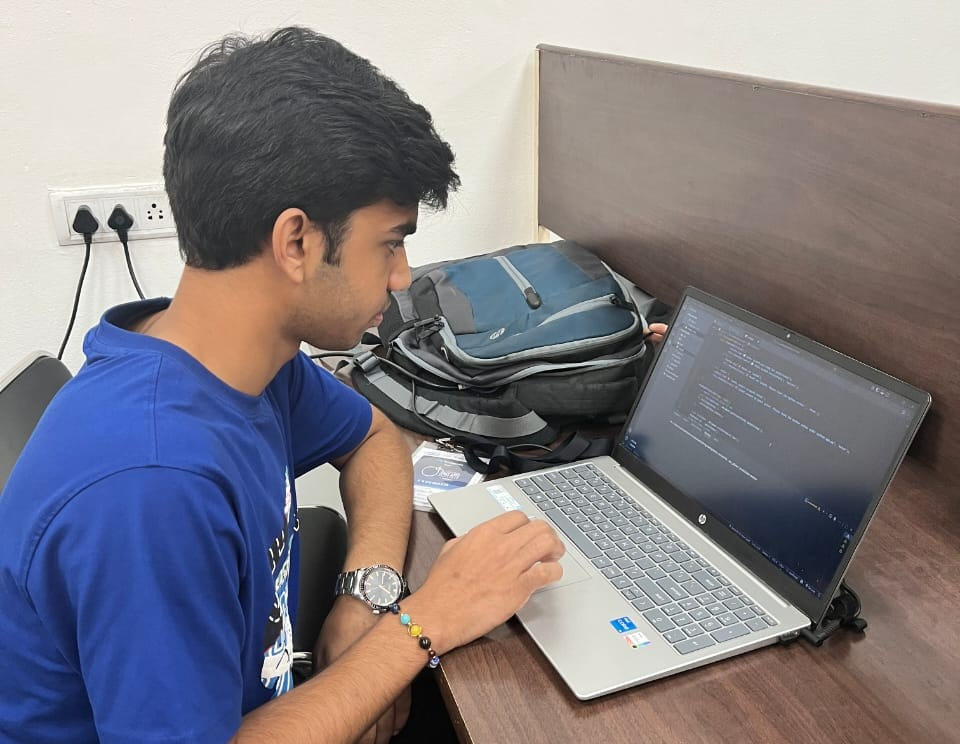
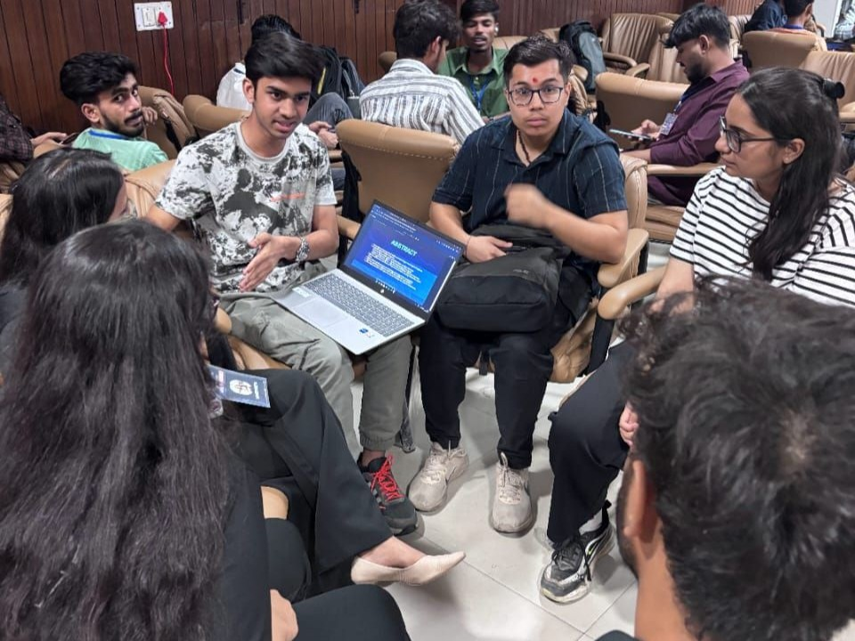

# Hey, I'm Shivam 👋

### AI & Data Science Undergraduate @ GGSIPU

I've developed a strong builder mindset—learning quickly, collaborating effectively, and shipping products that create real impact.

---

<!-- IMAGE 1: Professional Photo OR Best Hackathon Winning Photo -->

<p align="center">
  
</p>

## About Me

I'm an Artificial Intelligence & Data Science undergraduate at GGSIPU with a strong interest in building products that combine technology, innovation, and real-world impact.

Over the past few years, I've actively participated in hackathons, collaborated with talented teams, and transformed ideas into working products. These experiences have shaped a builder mindset focused on rapid execution, continuous learning, and solving meaningful problems.

My interests currently lie at the intersection of:

- Artificial Intelligence
- Backend Engineering
- Product Development
- Scalable Systems
- Emerging Technologies
---

<!-- IMAGE 2: Project Collage (Dashboard screenshots, product UI, architecture diagrams) -->

<p align="center">
  
</p>

I enjoy bringing ambitious people together and creating environments where ideas can turn into impactful products.

---

<!-- IMAGE 3: Workshop / Event Organising Photo -->

<p align="center">
  
</p>

## Hackathons

🏆 Winner of multiple inter-college hackathons

🚀 Finalist across national-level hackathons

🌍 Participant in global innovation events including Adobe Hackathon and NASA Space Apps Challenge

💡 Passionate about building under pressure, solving challenging problems, and collaborating with high-performing teams

---

<!-- IMAGE 4: Team Photo / Hackathon Stage Photo -->

<p align="center">
  
</p>

## Tech I Work With

```txt
Python • JavaScript • Java • SQL

AI/ML • Django • Flask
React • Node.js • Express

Git • Linux • Docker

REST APIs • System Design
```

## GitHub Stats

<p align="center">
  
  
</p>

---

## Connect With Me

💼 LinkedIn: www.linkedin.com/in/skyrex06

🏆 Devfolio: YOUR_DEVFOLIO_LINK

🌐 Portfolio: YOUR_PORTFOLIO_LINK

📧 Email: shivamprasad5953@gmail.com

---

> "Build things that matter. Learn relentlessly. Ship relentlessly."
