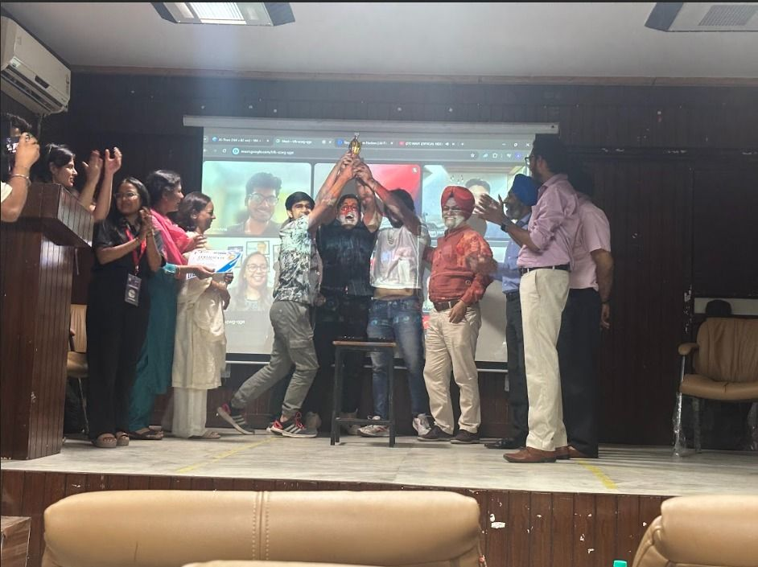

# Hey, I'm Shivam 👋

### AI & Data Science Undergraduate @ GGSIPU
---

<!-- IMAGE 1: Professional Photo OR Best Hackathon Winning Photo -->

<p align="center">
  
</p>

## About Me

I'm passionate about building innovative products that solve real-world problems. My interests lie at the intersection of AI, software engineering, and emerging technologies, where I enjoy transforming ideas into practical and scalable solutions.

Over the past few years, I've actively participated in hackathons, collaborated with talented teams, and transformed ideas into working products. These experiences have shaped a builder mindset focused on rapid execution, continuous learning, and solving meaningful problems.


<p align="center">
  
  
</p>

## Hackathons

🏆 Winner of multiple inter-college hackathons

🚀 Finalist across national-level hackathons

🌍 Participant in global innovation events including Adobe Hackathon and NASA Space Apps Challenge

💡 Passionate about building under pressure, solving challenging problems, and collaborating with high-performing teams

---


## Tech I Work With

```txt
Python • JavaScript • Java • CPP • SQL

AI/ML • Django • Flask
React • Node.js • Express

Git • Linux • Docker

REST APIs • System Design
```

## GitHub Stats


---

## Connect With Me

💼 LinkedIn: www.linkedin.com/in/skyrex06

📧 Email: shivamprasad5953@gmail.com

---

> "Build things that matter. Learn relentlessly. Ship relentlessly."
